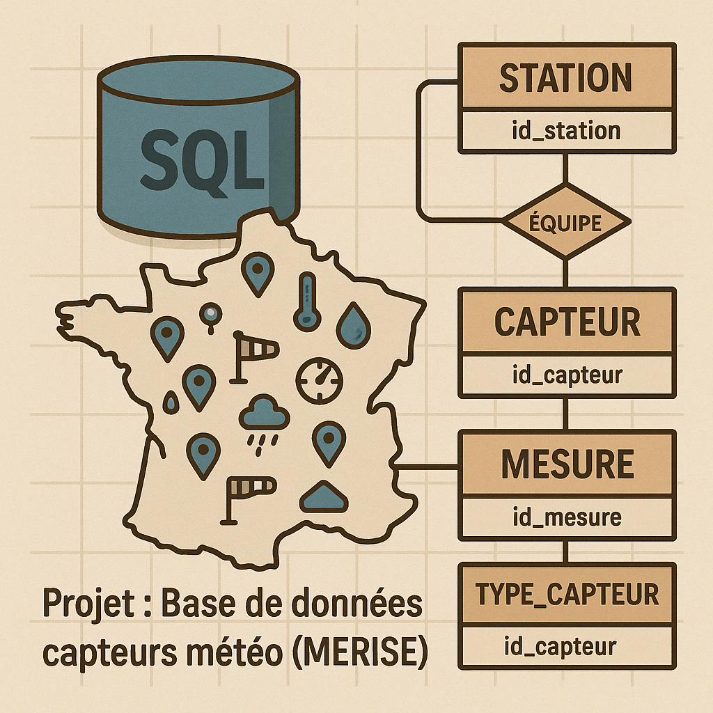

# Projet-ClearDATA

## Plus d'infos sur : https://corentin-cartallier.gitbook.io/projet-clear-data  

  

Projet réalisé durant ma première année d'école d'ingénieur au CESI.  
  
Clear-DATA est une base de données relationnelle conçue pour centraliser et analyser des mesures de pollution atmosphérique issues de capteurs répartis sur le territoire.  
Le projet couvre la modélisation, le peuplement, la validation et la création de requêtes de synthèse dans le respect des contraintes RGPD.  
